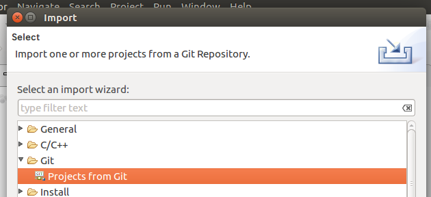
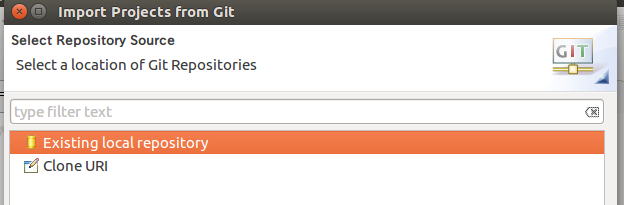
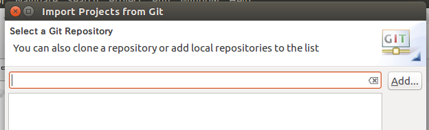
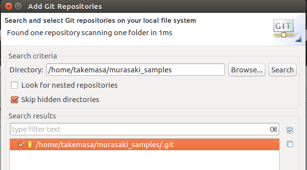
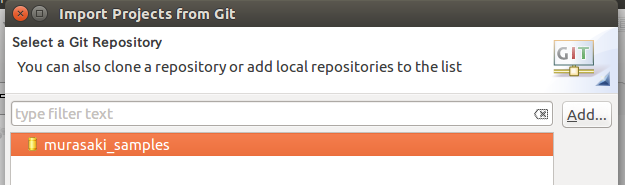
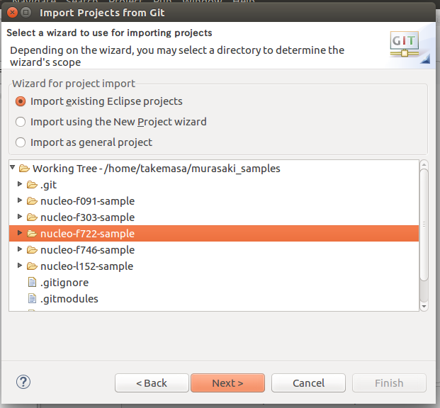

# Sample programs of Murasaki Class library
A set of the sample program which runs on ST Micro Nucleo boards.

## Talbe of Contents
 * [Description](#description)
 * [Requirement](#requirement)
 * [Where to get](#where-to-get)
 * [Install](#install)
 * [License](#license)
 * [Author](#author)
# Description
There are two type of the sample programs.
 * Sample program for Nucleo 64 and 144
 * Sample program for Nucleo 32

The samples program for the Nucleo 64 and 144 demonstrate following functionalitiy :
 * GPIO output
 * Interrupt and Task synchronization
 * Task
 * I2C master
 * Printf() functionalitiy

Once sterted, the program print out a message to the serial termnial and blinks the LED on the Nucleo board. The serial terminal specificaiton is :
 * 115200baud
 * 8bit
 * None parity
 * 1 stop bit

When user push a user button on the board, it raises an EXTI interrupt, and this interrupt releases a task to search for I2C.

The demonstration on the Nucleo 32 is just blinking LED.

# Requirement
* [SW for STM32](https://www.st.com/ja/development-tools/sw4stm32.html) (Tested with v 1.6.0)
* Nucleo
   * [Nucleo F746ZG](https://www.st.com/en/evaluation-tools/nucleo-f746zg.html)(Cortex-M7)
   * [Nucleo F722ZE](https://www.st.com/en/evaluation-tools/nucleo-f722ze.html)(Cortex-M7)
   * [Nucleo L152RE](https://www.st.com/en/evaluation-tools/nucleo-l152re.html)(Cortex-M3)
   * [Nucleo F091RC](https://www.st.com/en/evaluation-tools/nucleo-f091rc.html)(Cortex-M0)
   * [Nucleo F303K8](https://www.st.com/en/evaluation-tools/nucleo-f303k8.html)(Cortex-M4)

# Where to get
The Murasaki Samples can be obtained from [Github project page](https://github.com/suikan4github/murasaki_samples/)

# Install
Run following command on the shell wingow to clone the git repository of the Murasaki Samples. Note : Do not clone the repository into the Eclipse workspace. The repository must be located at independent path.
```bash
git clone git@github.com:suikan4github/murasaki_samples.git
cd murasaki_samples
git submodule update
```







# License
The Murasaki Sample programs are distributed under [MIT License](https://github.com/suikan4github/murasaki_samples/blob/master/LICENSE)
# Author
[Seiichi "Suikan" Horie](https://github.com/suikan4github)
