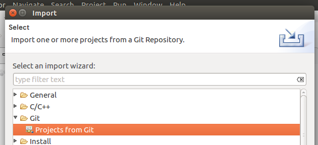
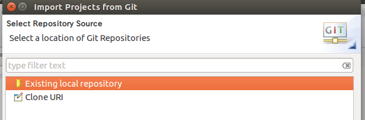
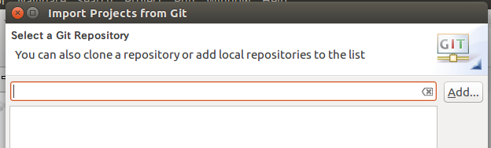
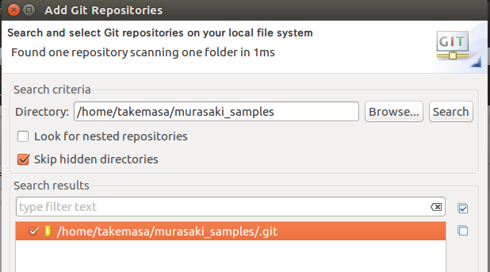
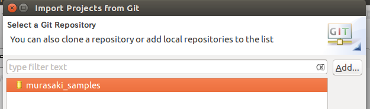
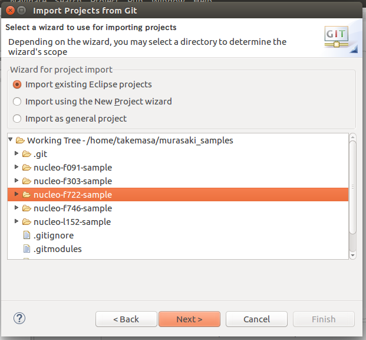

# Sample programs of Murasaki Class library
A set of the [Murasaki class library](https://github.com/suikan4github/murasaki) sample program which runs on ST Micro Nucleo boards.

## Talbe of Contents
 * [Description](#description)
 * [What's new](#whats-new)
 * [Test environment](#test-environment)
 * [Supported target](#supported-target)
 * [Where to get](#where-to-get)
 * [Install](#install)
 * [License](#license)
 * [Author](#author)
# Description

This repogitory contains the sample programs for  Nucleo 64 and 144
 
The samples programs  demonstrate following functionality :
 * GPIO output
 * Interrupt and Task synchronization
 * Task
 * I2C master
 * Printf() functionality

Once started, the program prints out a message to the serial terminal and blinks the LED on the Nucleo board. The serial terminal specification is :
 * 115200baud
 * 8bit
 * None parity
 * 1 stop bit

When a user push a user button (blue button) on the Nucleo board, it raises an EXTI interrupt, and this interrupt releases a task to search for I2C.

The demonstration on the Nucleo 32 is just a blinking LED.

# What's new
Adapted to [Murasaki](https://github.com/suikan4github/murasaki) v4.0.0.
# Test environment
* Ubuntu 22.04 LTS
* [STM32 CubeIDE](https://www.st.com/en/development-tools/stm32cubeide.html) (Tested with v 1.12.0)

# Supported target
* Nucleo
   * [Nucleo H743ZI](https://www.st.com/en/evaluation-tools/nucleo-h743zi.html) (Cortex-M7)
   * [Nucleo F746ZG](https://www.st.com/en/evaluation-tools/nucleo-f746zg.html) (Cortex-M7)
   * [Nucleo F722ZE](https://www.st.com/en/evaluation-tools/nucleo-f722ze.html) (Cortex-M7)
   * [Nucleo H503RB](https://www.st.com/en/evaluation-tools/nucleo-h503rb.html) (Cortex-M33)
   * [Nucleo F091RC](https://www.st.com/en/evaluation-tools/nucleo-f091rc.html) (Cortex-M0)
   * [Nucleo F446RE](https://www.st.com/en/evaluation-tools/nucleo-f446re.html) (Cortex-M4)
   * [Nucleo G070RB](https://www.st.com/en/evaluation-tools/nucleo-g070rb.html) (Cortex-M0+)
   * [Nucleo G431RB](https://www.st.com/en/evaluation-tools/nucleo-g431rb.html) (Cortex-M4)
   * [Nucleo L152RE](https://www.st.com/en/evaluation-tools/nucleo-l152re.html) (Cortex-M3)
   * [Nucleo L412RB-P](https://www.st.com/en/evaluation-tools/nucleo-l412rb-p.html) (Cortex-M4)

Known issue : At the point of the Jul/07/2023, following target doesn't work correctly. 
 * Nucleo L152RE : The bug in the CubeIDE 1.12 prevents to build the EXTI class. See the [report](https://github.com/suikan4github/stm32-defects#d006-stm32l1-hal_exti-wrong-configuration) . 

# Where to get
The Murasaki Samples can be obtained from [Github project page](https://github.com/suikan4github/murasaki_samples/)

# Install
## Clone the repository
Run the following command on the shell window to clone the git repository of the Murasaki Samples. Note: Do not clone the repository into the Eclipse workspace. The repository must be located at an independent path.
```bash
git clone --recursive git@github.com:suikan4github/murasaki_samples.git
```
## Import project from git
You have to import a desired project from the cloned repository. Again, the workspace of the SW4STM32 must be located other place from the cloned repository.

First. From the Menu bar, Chose File->Import. Then, select the "Projects from Git", and click "Next" button.


## Select Repository Source
Select the "Existing local repository" and click "Next".


## Select a Git Repository
You don't have the murasaki_samples repository for the first time. So, click the "Add..." button.


## Search and select Git repositories on your local file system
To identify the repository directory, click the "Browse..." button and chose the cloned repository. Then, select the murasaki_samples in the search results.

And click "Next"


## Select a Git Repository
We are back again. Now, select the "murasaki_samples", then click "Next".


## Select a wizard to use for importing project

Select the "import existing Eclipse projects" radio button. Then, select the desired project to import. Then click.

Now, you are ready to import. Follow the instructions.


# License
The Murasaki Sample programs are distributed under [MIT License](https://github.com/suikan4github/murasaki_samples/blob/master/LICENSE)
# Author
[Seiichi "Suikan" Horie](https://github.com/suikan4github)
